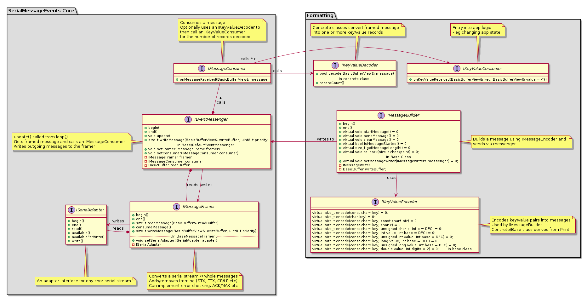

# The SerialMessageEvents Library

This is an event library for serial message inputs and is part of the [InputEvents](https://github.com/Stutchbury/InputEvents) family.

The library will take character (`char`) input from any serial source via a serial adapter, creating a message from the stream, pass it to your message consumer class or method and optionally pass decoded key/value pairs to your key/value consumer.

The library makes no assumptions about message size or the length of keys and values - there are only two buffers which are user defined, so can be created where best suits your project.

The `BasicBuffer` and `BasicBufferView` classes provide a pointer to the user buffer together with the buffer size and the length of the buffer contents. 

The reference to the read buffer is 'owned' by the `IEventMessenger`, is populated from a serial stream by the framer and no copies are made on the way to (and including) the key/value decoder.

The reference to the wtite buffer is 'owned' by the `IMessageBuilder` and written though to serial without copying.

The `IEventMessenger` will pass messages to either a class or function consumer but its use is optional - you can also directly read from and write to the framer.

Queues can be implemented in the `IMessageFramer` and/or the `IEventMessenger` if desired. The `BasicBufferQueue` class is included in the library. A char buffer can also be implemented in the `ISerialAdapter`.

A default `IMessageBulder` class makes it easy to encode key/value pairs and wrtie them to the `IEventMessenger` (or framer directly).

A number of formatters (message encoders and decoders) are provided for delimited (using any `char`), fixed key & value length or fixed key length key/value pairs.

# SUPPORT

Feedback, [bug reports](https://github.com/Stutchbury/SerialMessageEvents/issues) and pull requests are very welcome or chat on [Discord](https://discord.gg/GDcEcWPKKm) if you have any questions.